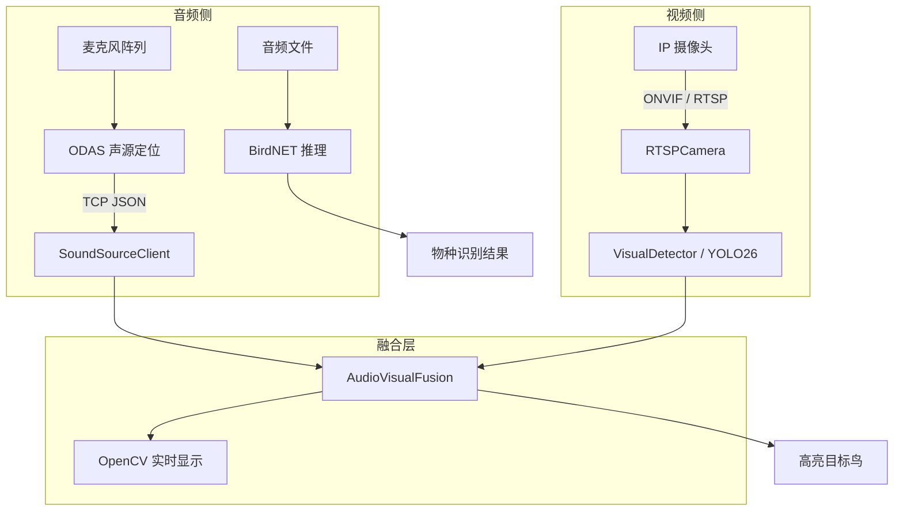

# Intel Cup · 鸟类活动 AI 监测员

基于**音频阵列声源定位**、**BirdNET 鸟类声学识别**与 **YOLO 视觉检测**的声觉–视觉融合监测系统。项目面向野外/园区鸟类活动监测场景，将 ODAS 声源方向与摄像头画面中的鸟类目标进行匹配，实现“听见 + 看见”的协同感知。

**仓库地址：** [github.com/zeyugeng/intel-cup](https://github.com/zeyugeng/intel-cup)

---

## 功能概览

| 模块 | 技术栈 | 作用 |
|------|--------|------|
| 声源定位 | ODAS + TCP JSON | 接收麦克风阵列估计的声源方向 `(x, y)` 与能量 `E` |
| 视觉检测 | YOLO26 + OpenCV | 在 RTSP 视频流中检测鸟类（默认 COCO `bird` 类别） |
| 声视融合 | 自定义匹配逻辑 | 将声源横向位置与检测框中心对齐，高亮“正在发声”的目标 |
| 声学识别 | BirdNET 2.4 | 对录音文件进行物种识别与置信度输出 |
| 云台控制 | ONVIF PTZ | 控制云台摄像头转动、预览 RTSP 并叠加声源信息 |
| 监测 GUI | Tkinter | 展示鸟类信息列表与视频区域的界面原型 |

---

## 系统架构



---

## 目录结构

```
intel-cup/
├── core/                   # 核心业务逻辑
├── gui/                    # 图形界面
├── scripts/                # 可执行入口脚本
├── data/                   # 数据与样例
├── models/                 # 模型权重（需自行放置，已 gitignore）
├── output/                 # 运行输出（已 gitignore）
├── docs/                   # 项目文档与演示材料
├── requirements.txt        # Python 依赖
├── environment.yml         # Conda 环境配置
├── .gitignore
├── LICENSE
└── README.md
```

---

## 文件说明

### `core/` — 核心模块

| 文件 | 作用 |
|------|------|
| `config.py` | 全局配置：`CameraConfig`（摄像头）、`SoundConfig`（声源服务器）、`VisualConfig`（YOLO）、`PTZConfig`（云台） |
| `paths.py` | 项目路径常量：模型、音频、数据集、输出目录等 |
| `camera.py` | `RTSPCamera`：通过 ONVIF 获取 RTSP 地址，后台线程低延迟抓帧 |
| `sound_client.py` | `SoundSourceClient`：连接 ODAS 声源 TCP 服务，解析 JSON 行数据 |
| `visual_detector.py` | `VisualDetector`：YOLO26 推理、坐标归一化、检测框绘制 |
| `fusion.py` | `AudioVisualFusion`：声源方向与视觉检测目标匹配，高亮发声鸟类 |
| `birdnet_infer.py` | BirdNET 音频物种识别、结果格式化与 benchmark 工具 |
| `ptz_camera.py` | `PTZCameraController`：云台 ONVIF 控制、RTSP 预览、截图/录像 |
| `__init__.py` | 包导出：`config`、`paths` 等公共接口 |

### `scripts/` — 启动脚本

| 文件 | 作用 |
|------|------|
| `run_fusion.py` | **声视融合监测**（主功能）：ODAS 声源 + RTSP + YOLO 检测 |
| `run_visual.py` | 仅视觉检测：RTSP 视频流 + 鸟类框选 |
| `run_birdnet.py` | BirdNET 声学识别：分析 `wav` 等音频文件 |
| `run_sound_client.py` | 调试 ODAS 声源 TCP 数据流 |
| `run_ptz.py` | 云台控制 + RTSP 预览 + 声源叠加 |
| `run_gui.py` | 启动 Tkinter 监测界面原型 |

### `gui/` — 图形界面

| 文件 | 作用 |
|------|------|
| `monitor.py` | `BirdMonitorWindow`：鸟类信息表格 + 视频区域 + 演示数据按钮 |
| `__init__.py` | GUI 包标识 |

### `data/` — 数据

| 路径 | 作用 |
|------|------|
| `data/audio/` | 测试音频与识别结果（大文件已在 `.gitignore` 中忽略） |
| `data/datasets/coco8/` | Ultralytics 示例数据集，可用于 YOLO 训练/验证 |

### 其他

| 文件/目录 | 作用 |
|-----------|------|
| `models/yolo26n.pt` | YOLO26n 检测权重（需自行下载放入，已被忽略） |
| `output/` | 截图、训练结果、预测输出（运行时自动生成） |
| `docs/` | 项目介绍 PPT 等文档材料 |
| `requirements.txt` | pip 依赖列表 |
| `environment.yml` | Conda 环境：`intel_cup`，Python 3.11 |

---

## 环境要求

- **Python 3.11–3.13**（BirdNET 0.2.x 要求，推荐 3.11）
- 摄像头支持 **ONVIF / RTSP**
- 声源定位服务（如 **ODAS**）通过 TCP 推送 JSON
- 可选 GPU 加速 YOLO 推理（修改 `VisualConfig.device`）

---

## 快速开始

### 1. 克隆仓库

```bash
git clone https://github.com/zeyugeng/intel-cup.git
cd intel-cup
```

### 2. 创建环境

**Conda（推荐）：**

```bash
conda env create -f environment.yml
conda activate intel_cup
```

**或 pip：**

```bash
python -m venv .venv
# Windows
.venv\Scripts\activate
# Linux / macOS
source .venv/bin/activate

pip install -r requirements.txt
```

### 3. 准备模型与数据

```bash
# 将 YOLO 权重放到 models/ 目录
# 文件名需与 core/paths.py 中 YOLO_MODEL_PATH 一致：yolo26n.pt

# 将测试音频放到 data/audio/（例如 soundscape.wav）
```

首次使用 Ultralytics 时也可通过 Python 自动下载预训练权重，再复制到 `models/`。

### 4. 修改配置

在 `core/config.py` 中按实际硬件修改：

- `CameraConfig`：摄像头 IP、账号、分辨率
- `SoundConfig`：ODAS 服务器地址与端口
- `PTZConfig`：云台摄像头地址
- `VisualConfig`：检测置信度、设备（`cpu` / `cuda`）

---

## 运行示例

所有脚本均从**项目根目录**执行：

```bash
# 声视融合监测（核心功能）
python scripts/run_fusion.py

# 仅视觉鸟类检测
python scripts/run_visual.py

# BirdNET 鸟类声学识别
python scripts/run_birdnet.py
python scripts/run_birdnet.py data/audio/testau.wav

# 调试声源 TCP 数据
python scripts/run_sound_client.py

# 云台 + 声源预览
python scripts/run_ptz.py

# GUI 界面原型
python scripts/run_gui.py
```

实时预览窗口中按 **`q`** 退出。

---

## 声视融合原理

1. **声源侧**：`SoundSourceClient` 接收 ODAS 推送的 `x`（横向，约 -1~1）、`y`、`E`（能量）。
2. **视觉侧**：`VisualDetector` 用 YOLO 检测鸟类，将框中心归一化到同一坐标系。
3. **匹配**：当声源能量超过阈值时，选取横向位置 `|sound_x - det_x|` 最小的检测框。
4. **展示**：匹配目标以洋红色粗框标注为 `Target Bird N`，其余为绿色框。

---

## 依赖说明

| 包 | 用途 |
|----|------|
| `opencv-python` | 视频采集、显示、图像处理 |
| `ultralytics` | YOLO26 目标检测 |
| `onvif-zeep` | 摄像头 ONVIF 协议与 PTZ 控制 |
| `birdnet` | 鸟类声学物种识别 |
| `tensorflow` | BirdNET 推理后端 |
| `soundfile` | 音频读写 |
| `Pillow` | GUI 图像处理 |

---

## 许可证

本项目采用 [MIT License](LICENSE)。

---

## 作者

[zeyugeng](https://github.com/zeyugeng)
